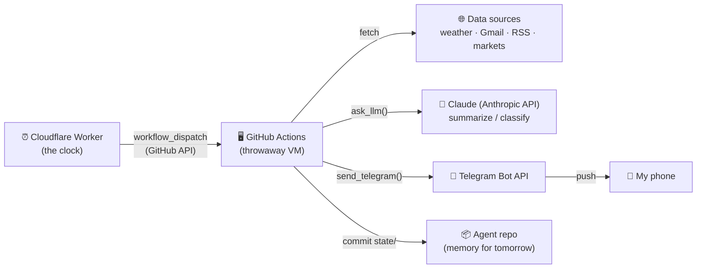
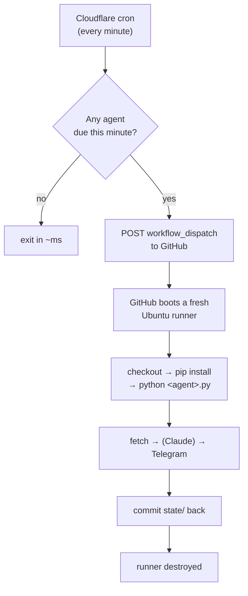
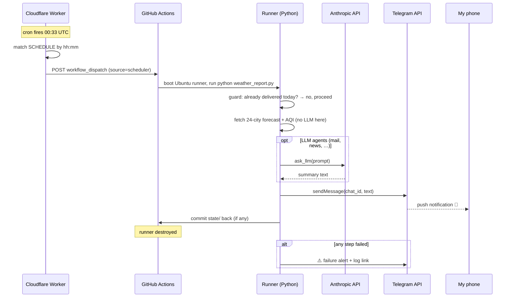
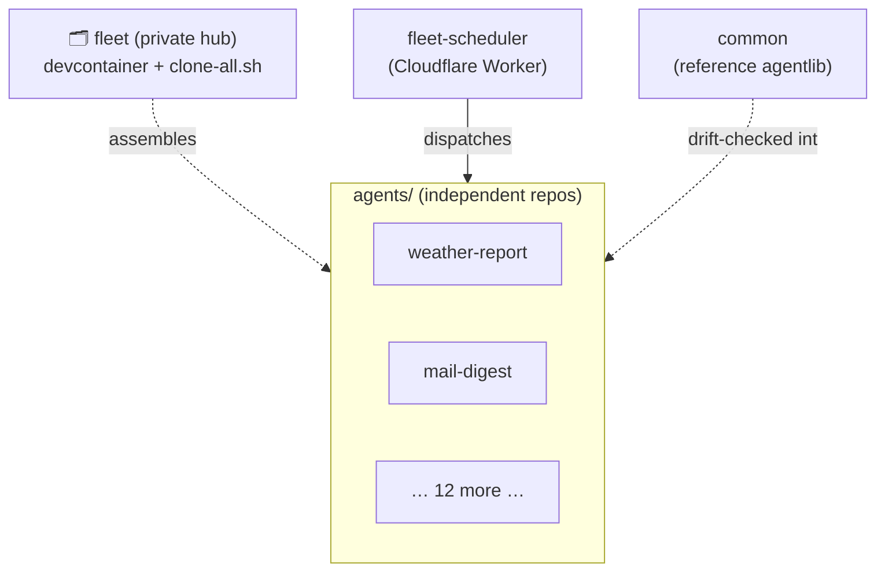

# Fleet architecture

How a fleet of ~14 autonomous personal agents runs every day with **zero
always-on servers**, delivers to Telegram, and stays reliable — end to end.

> **TL;DR** — A serverless clock (Cloudflare Worker) wakes a throwaway VM
> (GitHub Actions runner) at each agent's exact minute. The VM runs a small
> Python script that **fetches** information, optionally asks **Claude** to
> summarize it, and **calls the Telegram API** to deliver the result to my
> phone. Then the VM is destroyed. Nothing of mine is ever "running" in
> between.

---

## Contents

1. [Mental model](#mental-model)
2. [Design principles](#design-principles)
3. [The two execution planes](#the-two-execution-planes)
4. [Component deep-dive](#component-deep-dive)
5. [The full lifecycle of one message](#the-full-lifecycle-of-one-message)
6. [Reliability model](#reliability-model)
7. [State &amp; memory](#state--memory)
8. [Secrets &amp; security](#secrets--security)
9. [The agent catalog](#the-agent-catalog)
10. [Cost model](#cost-model)
11. [Repository topology](#repository-topology)

---

## Mental model

Three facts explain almost everything:

1. **Nothing is always on.** Every layer is *summoned*, does one job, and
   disappears — the clock, the compute, and the intelligence are all
   on-demand. There is no daemon, no web server, no container I keep alive.
2. **The Python script is the pilot; Claude is a tool it calls.** The agent
   code orchestrates. It *asks* Claude for a summary the same way it asks a
   weather API for a forecast — one step in a pipeline, not the driver.
3. **Telegram is the last mile.** Each agent talks *as* its own Telegram bot.
   Delivery, push notifications, and multi-device sync are Telegram's job.
   I got a cross-platform app for free instead of building one.



---

## Design principles

These are enforced across every repo (see each agent's README and the fleet
hub's `CLAUDE.md`):

| Principle | What it means in practice |
|---|---|
| **One agent, one repo, one concern** | Each agent is an independent Git repo with its own remote, schedule, secrets, and Telegram bot. They run and fail *independently* — one breaking never touches another. |
| **Serverless, on-demand only** | No process runs between jobs. Compute exists for the ~30s a run takes. |
| **Fail loud, or stay silent — never filler** | A failure alerts immediately on Telegram. An agent with nothing worth saying (e.g. no notable cricket match) sends *nothing* rather than noise. |
| **Punctual primary + reliable backup** | A Cloudflare Worker dispatches on time; GitHub's own cron is a late-but-reliable fallback. Guards prevent double-sends. |
| **State saved *after* the send** | An agent that benefits from memory commits a small `state/` file back — but only after delivery succeeds, so a state failure never costs a message. |
| **Deterministic where possible** | If the job is mechanical (weather, markets), there's **no LLM** — cheaper, faster, no hallucination surface. The model is used only where judgment helps. |
| **Minimal dependencies** | Python standard library preferred; the only shared third-party reach is `requests` and the Anthropic SDK. |
| **Tests run in CI** | Repos with suites run `tests.yml` on every push; offline, no secrets needed. |

---

## The two execution planes

The fleet runs on **two different clocks and two different computers**, but
the *last mile is identical* — every agent ends by calling the same
`send_telegram()`.

### Plane A — Cloud agents (12)

Scheduled by the Cloudflare Worker, executed on GitHub Actions runners.
Used for anything that doesn't need the laptop.



### Plane B — Local agents (2)

`housekeeper` and `daily-review` inspect the laptop itself (disk, battery,
failed services, today's commits), so they run **on the machine** via a
**systemd timer** — Linux's built-in scheduler. No Cloudflare, no GitHub
Actions. Steps 3–5 (fetch → Claude → Telegram) are the same.

```ini
# housekeeper.timer — runs nightly at 21:30 IST, catches up if the laptop was off
[Timer]
OnCalendar=*-*-* 21:30:00
Persistent=true          # missed run (asleep/off) fires once at next boot
RandomizedDelaySec=120
```

```ini
# housekeeper.service — oneshot, waits for network, retries on early-boot failure
[Service]
Type=oneshot
Restart=on-failure
RestartSec=120
ExecStart=/home/jayanth/agents/housekeeper/.venv/bin/python .../housekeeper.py
```

---

## Component deep-dive

### 1. `fleet-scheduler` — the clock (Cloudflare Worker)

A single Worker with **one cron trigger** (`* * * * *`) — it fires **once a
minute**, all day. Rather than juggle 13 separate cron expressions (against
Cloudflare's per-Worker trigger limit), it keeps an every-minute heartbeat
and does the matching in code:

- Compute the current UTC `hh:mm`.
- Filter a `SCHEDULE` table (13 tick-times) for entries due now — respecting
  weekday for weekly agents (`release-radar` Mon, `papers-digest` Sat).
- For each match, `POST` to GitHub's
  `…/actions/workflows/<agent>.yml/dispatches` with
  `inputs.source = "scheduler"` (so the workflow's guard can tell a scheduler
  dispatch apart from a human clicking "Run workflow").
- **13 minutes a day** dispatch something; the other **~1,427 ticks** match
  nothing and the Worker exits in milliseconds.

**Why it exists:** GitHub's own cron is best-effort — minutes-to-hours late
under load, occasionally dropped entirely (measured 4h late on 2026-07-04).
`workflow_dispatch` runs, by contrast, start within seconds. So the *authority
on time* moved to Cloudflare, whose cron triggers are punctual (~6s to
dispatch). If the Worker itself fails to dispatch, it alerts on Telegram — and
the GitHub backup crons still deliver late anyway.

> Even the clock is serverless: Cloudflare invokes a fresh instance of the
> Worker every minute; it isn't a loop watching a clock.

### 2. GitHub Actions — the compute (per-agent workflow)

Each agent repo has a `<agent>.yml` workflow with three trigger types:

```yaml
on:
  schedule:
    - cron: '30 0 * * *'   # backup   (00:30 UTC = 06:00 IST)
    - cron: '33 1 * * *'   # backup   (1h later) — guard skips if primary delivered
  workflow_dispatch:        # the Cloudflare Worker (and manual "Run workflow")
    inputs: { source: '' }  # "scheduler" when dispatched by the Worker
```

A run proceeds through these steps:

1. **Guard / dedupe** — For scheduled or scheduler-sourced runs, query the
   GitHub API for *today's* runs of this workflow; if one is already
   `queued`/`in_progress`/`success`, **skip**. Truly-manual runs always
   proceed. The guard **fails open** — a broken check must never cost a send.
2. **checkout → setup-python 3.12 → `pip install -r requirements.txt`**.
3. **Run agent** — `python <agent>.py`, with secrets injected as env vars
   (`TELEGRAM_BOT_TOKEN`, `TELEGRAM_CHAT_ID`, `ANTHROPIC_API_KEY`).
4. **Persist state** *(agents with memory)* — if `state/` changed, commit and
   push it back to the repo as the `github-actions[bot]`. Best-effort: a state
   push failure is logged, never fatal.
5. **Alert on failure** — if any step failed, `curl` the Telegram API directly
   to ping me with a link to the run log — from this agent's own bot.

### 3. The agent — the pilot (Python)

Every agent is one file, `<agent>.py`, with a `main()` that:

1. **Fetches** its inputs (HTTP APIs, RSS, Gmail, the GitHub API, local
   system probes…).
2. **Optionally calls Claude** via `ask_llm()` to summarize, classify, rank,
   or dedupe. **2 of 14 agents skip this entirely** (weather, markets — pure
   deterministic formatting). `papers-digest` and `repo-review` call it
   **twice** (multi-stage: shortlist, then deep review).
3. **Builds the message** and calls `send_telegram(text)` — the final step.

### 4. `agentlib.py` — the shared plumbing

Two functions, imported by every agent so delivery/summarize code exists
exactly once:

```python
def ask_llm(prompt, model="claude-haiku-4-5", max_tokens=2000):
    """Single-turn Claude call → text. Anthropic SDK handles retries
    (429/5xx/connection) internally."""
    client = Anthropic()               # ANTHROPIC_API_KEY from env
    response = client.messages.create(model=model, max_tokens=max_tokens,
                                       messages=[{"role": "user", "content": prompt}])
    return next(b.text for b in response.content if b.type == "text")

def send_telegram(text):
    """POST to https://api.telegram.org/bot<token>/sendMessage,
    split into <=4000-char chunks. One retry on connection blips
    (a built message is precious); HTTP errors raise immediately."""
```

- **Model:** Claude **Haiku 4.5** — fast and cheap, sufficient for
  summarize/classify workloads.
- **The `common` repo holds the reference copy.** Every agent vendors its own
  `agentlib.py`, and a nightly job **drift-checks** each vendored copy against
  `common`'s reference so they can't silently diverge.

### 5. Claude / Anthropic API — the intelligence

Reached only through `ask_llm()`. It receives a prompt (the fetched raw
material + instructions) and returns text. It is **stateless** and
**delivery-blind** — it never sees Telegram, never sees my chat, never
persists anything. Its output flows back into the Python script, which decides
what to do with it.

### 6. Telegram — the last mile

`send_telegram()` makes an ordinary HTTPS `POST` **from the runner** to the
Telegram Bot API. The message is addressed to my `chat_id`; Telegram's servers
push it to every device I'm logged into. Each agent has its **own bot token**,
so messages arrive from distinct senders ("weather bot", "markets bot") into
one Telegram — a natural, labelled inbox. Setup was one-time: create the bot
via BotFather → get its token → open a chat with it → record my chat id.

---

## The full lifecycle of one message

A cloud agent (weather-report, 06:00 IST) from tick to phone:



---

## Reliability model

Delivery is defended in depth:

- **Punctual primary:** Cloudflare Worker dispatches at the exact minute.
- **Late-but-reliable backup:** each agent's own GitHub cron (~1h later). If
  Cloudflare or the primary run failed, the backup still delivers.
- **Dedupe guard:** the workflow checks whether today's run already delivered
  before sending, so the primary + backup can never both fire a duplicate.
  It **fails open** — if the check itself breaks, the message still goes.
- **Fail-loud alerts:** any run that dies pings Telegram immediately, with a
  link to the failing log — from the agent's own bot.
- **Watchdog:** `daily-review` (22:15) sweeps the day and flags any agent that
  should have delivered but didn't — a backstop above the per-run alerts.
- **State saved after send:** memory is committed only once delivery
  succeeded, so a `git push` failure never costs a message.
- **Odd-minute schedules:** ticks avoid top-of-hour cron congestion.

---

## State &amp; memory

Some agents benefit from remembering yesterday. Those keep a small file
committed back into their own repo by the workflow **after** the send:

| Repo | File | Remembers |
|---|---|---|
| `repo-review` | `state/` | prior review findings, to follow through |
| `news-briefing`, `tech-news` | `state/seen.json` (+ news' `briefed.json`, 7d) | links already surfaced, to dedupe across days; what the bullets said, for continuity + Sunday arcs |
| `study-coach` | `state/served.json` | problems/topics already served |
| `mail-digest` | `state/noise.json` | learned noise/unsubscribe trends |
| `eng-blogs` | `data/` | a growing full-text corpus (future RAG) |

Because these are bot-committed daily, a local clone must `git pull` before
editing — the state belongs to the agent, not to a human editor.

---

## Secrets &amp; security

- **No secret ever lives in code.** All are injected at runtime:
  - GitHub Actions agents: repo **Actions secrets** → env vars
    (`TELEGRAM_BOT_TOKEN`, `TELEGRAM_CHAT_ID`, `ANTHROPIC_API_KEY`).
  - The Cloudflare Worker: `wrangler secret put` (`GH_PAT` with Actions:write
    on the fleet repos, plus Telegram tokens for its own failure alerts).
  - Local agents: a systemd environment file on the laptop.
- **Least privilege:** each workflow declares only the `permissions` it needs
  (`contents: read`, or `contents: write` only for agents that persist state).
- **Independent blast radius:** one agent's leaked token exposes only that
  agent's bot, never the fleet.

---

## The agent catalog

Times are IST. "Brain" = whether the agent calls Claude.

| Agent | When | Brain | What it delivers |
|---|---|---|---|
| weather-report | 06:00 | ⚙️ deterministic | 24-city forecast + AQI, severe-weather watch |
| mail-digest | 06:07 &amp; 19:00 sweep | 🧠 1× | Gmail → VIP / NEEDS ACTION / CARRIED / deadline ledger, deep links |
| news-briefing | 06:00 &amp; 21:00 wrap | 🧠 2× | 7 sections (incl. 🏛 India + 🗽 US politics/immigration) from 41 sources, article-grounded, 👁 watchlist |
| cricket-scores | 06:17, 13:37 &amp; 21:47 | 🧠 1× | notable matches only — silent otherwise; Sun stats |
| tech-news | 06:59 &amp; 19:15 wrap | 🧠 2× | flagship: 9 sections from 45 sources, core topics (AI/data/infra/OS/hardware) up to 10 stories deep with ↳ background-context lines + deterministic HN TOP / CISA KEV patch-now, 👁 watchlist |
| markets-brief | 07:33 | ⚙️ deterministic | Nifty · Sensex · S&amp;P · Nasdaq · USD/INR · gold · BTC |
| release-radar | Mon 07:37 | 🧠 1× | weekly releases across my dependency stack |
| study-coach | 08:07 | 🧠 1× | one DSA problem/day, aimed at weak topics |
| finance-tracker | 08:31 | 🧠 1× | income/expense from bank alerts |
| papers-digest | Sat 09:07 | 🧠 2× | weekly arXiv, two-stage review of ~1500 papers |
| eng-blogs | 19:07 | 🧠 1× | 18 engineering blogs + growing corpus |
| repo-review | 19:37 | 🧠 2× | reviews every diff I push, remembers findings; 📈 rising repos |
| housekeeper | 21:30 *(local)* | 🧠 1× | laptop health: disk, failed units, battery |
| daily-review | 22:15 *(local)* | 🧠 1× | day review + fleet watchdog |

Plus infrastructure: **`fleet-scheduler`** (the clock), **`common`** (the
reference shared library), and **`fleet`** (the private workspace hub that
assembles everything in a Codespace).

> For a full per-agent breakdown — each one's data sources, pipeline, where
> Claude is used, state, and design decisions — see **[AGENTS.md](AGENTS.md)**.

---

## Cost model

The whole fleet runs inside free tiers:

- **Cloudflare Workers** — one Worker, ~1,440 sub-millisecond invocations/day,
  well within the free plan.
- **GitHub Actions** — ~13 short runs/day on public repos (free minutes).
- **Anthropic** — a handful of Haiku calls/day; small, bounded prompts.
- **Telegram** — free.

Because nothing is always on, there is no idle cost — the dominant expense is
a few cents of model usage.

---

## Repository topology

Every agent is an **independent Git repo** (`github.com/astroboy1183/<name>`)
with its own remote, CI, secrets, and bot. They are *not* submodules or a
monorepo. A private **hub** repo (`fleet`) holds only setup files — a
devcontainer and a `clone-all.sh` that assembles all the agents into an
`agents/` directory inside a Codespace for editing. The hub tracks *no* agent
code; each agent tracks itself.



---

*This document describes the system as built. Each agent's own README covers
its specific logic and design decisions — start there for any single agent.*
